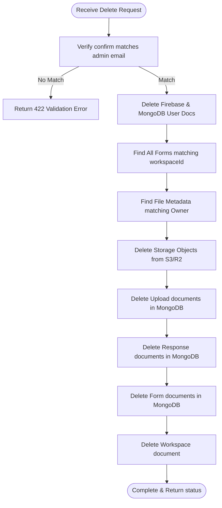

# Technical Design Document: Super Admin Backend APIs

This document details the database schemas, API routes, request/response contracts, and implementation flows for the **Super Admin Console** backend services.

---

## 1. Database Schema Definitions (MongoDB)

### 1.1 System Logs Schema (`system_logs`)
Stores platform events and error occurrences.
```typescript
import mongoose, { Schema, Document } from "mongoose";

export interface ISystemLog extends Document {
  level: "info" | "warn" | "error";
  message: string;
  route?: string;
  statusCode?: number;
  meta?: Record<string, any>;
  stack?: string;
  createdAt: Date;
}

const SystemLogSchema = new Schema<ISystemLog>({
  level: { type: String, enum: ["info", "warn", "error"], required: true, index: true },
  message: { type: String, required: true },
  route: { type: String },
  statusCode: { type: Number },
  meta: { type: Schema.Types.Mixed },
  stack: { type: String },
  createdAt: { type: Date, default: Date.now, expires: "30d" } // 30-day TTL purge
});

export const SystemLog = mongoose.model<ISystemLog>("SystemLog", SystemLogSchema);
```

### 1.2 Audit Logs Schema (`audit_logs`)
Append-only immutable collection tracking Super Admin actions.
```typescript
import mongoose, { Schema, Document } from "mongoose";

export interface IAuditLog extends Document {
  timestamp: Date;
  actorId: mongoose.Types.ObjectId;
  actorEmail: string;
  actorName: string;
  action: "admin.create" | "admin.edit" | "admin.suspend" | "admin.reactivate" | "admin.delete";
  targetId: string;
  targetType: "admin" | "workspace" | "form";
  before?: Record<string, any>;
  after?: Record<string, any>;
}

const AuditLogSchema = new Schema<IAuditLog>({
  timestamp: { type: Date, default: Date.now, required: true },
  actorId: { type: Schema.Types.ObjectId, ref: "User", required: true },
  actorEmail: { type: String, required: true },
  actorName: { type: String, required: true },
  action: { type: String, required: true, index: true },
  targetId: { type: String, required: true, index: true },
  targetType: { type: String, required: true },
  before: { type: Schema.Types.Mixed },
  after: { type: Schema.Types.Mixed }
});

export const AuditLog = mongoose.model<IAuditLog>("AuditLog", AuditLogSchema);
```

---

## 2. API Endpoints & Request/Response Contracts

All routes are prefixed with `/api/superadmin`.

### 2.1 GET `/api/superadmin/stats`
* **Security:** `requireSuperAdmin`
* **Response Body (`200 OK`):**
  ```json
  {
    "success": true,
    "stats": {
      "totalAdmins": { "active": 24, "suspended": 2 },
      "totalWorkspaces": 26,
      "totalForms": 152,
      "totalResponses": 8492,
      "totalStorageUsed": 245890012,
      "responsesLast24h": 340
    },
    "recentSignups": [
      {
        "name": "Jane Doe",
        "email": "jane@example.com",
        "workspaceName": "Acme Corp",
        "createdAt": "2026-07-24T12:00:00.000Z"
      }
    ]
  }
  ```

### 2.2 GET `/api/superadmin/abuse`
* **Security:** `requireSuperAdmin`
* **Response Body (`200 OK`):**
  ```json
  {
    "success": true,
    "abuse": {
      "topBlockedIps": [
        { "ipHash": "7f9208a0db1490ae", "hits": 142 }
      ],
      "topBlockedSlugs": [
        { "slug": "job-application", "hits": 98 }
      ],
      "honeypotDrops": 320
    }
  }
  ```

### 2.3 GET `/api/superadmin/logs`
* **Parameters:** `level` (string), `from` (ISO Date), `to` (ISO Date), `route` (string), `search` (string), `page` (number), `limit` (number).
* **Response Body (`200 OK`):**
  ```json
  {
    "success": true,
    "logs": [
      {
        "_id": "6a6328d1e...",
        "level": "error",
        "message": "Connection timeout",
        "route": "POST /api/public/submit",
        "statusCode": 504,
        "meta": { "timeoutMs": 15000 },
        "createdAt": "2026-07-24T14:00:00.000Z"
      }
    ],
    "pagination": {
      "total": 1,
      "page": 0,
      "limit": 50,
      "pages": 1
    }
  }
  ```

### 2.4 GET `/api/superadmin/admins`
* **Response Body (`200 OK`):**
  ```json
  {
    "success": true,
    "admins": [
      {
        "id": "6a632...",
        "name": "John Smith",
        "email": "john@test.com",
        "workspaceName": "Smith Consulting",
        "formCount": 12,
        "responseCount": 1204,
        "storageUsed": 1048576,
        "lastLogin": "2026-07-24T11:30:00.000Z",
        "status": "active"
      }
    ],
    "pagination": { "total": 1, "page": 0, "limit": 20 }
  }
  ```

### 2.5 POST `/api/superadmin/admins`
* **Request Body:**
  ```json
  {
    "name": "Admin Name",
    "email": "admin@example.com",
    "workspaceName": "Workspace Name"
  }
  ```
* **Response Body (`201 Created`):**
  ```json
  {
    "success": true,
    "message": "Admin account provisioned successfully",
    "admin": {
      "id": "6a63...",
      "name": "Admin Name",
      "email": "admin@example.com",
      "workspaceId": "6a64..."
    }
  }
  ```

### 2.6 PATCH `/api/superadmin/admins/:id`
* **Request Body:**
  ```json
  {
    "name": "Updated Name",
    "workspaceName": "Updated Workspace",
    "status": "suspended" | "active"
  }
  ```

### 2.7 DELETE `/api/superadmin/admins/:id`
* **Request Body:**
  ```json
  {
    "confirm": "admin@example.com"
  }
  ```
* **Response Body (`200 OK` or `207 Multi-Status`):**
  ```json
  {
    "success": true,
    "message": "Admin deleted completely",
    "cascadeResult": {
      "userDeleted": true,
      "workspaceDeleted": true,
      "formsDeleted": 23,
      "responsesDeleted": 512,
      "filesCleared": { "successCount": 8, "failedCount": 0 }
    }
  }
  ```

---

## 3. Middleware Implementations (Express)

### 3.1 `requireSuperAdmin` Middleware
```typescript
import { Request, Response, NextFunction } from "express";

export const requireSuperAdmin = (req: Request, res: Response, next: NextFunction): void => {
  const user = (req as any).user;
  if (!user || user.role !== "super_admin") {
    res.status(403).json({
      success: false,
      message: "Access Denied: Super Admin credentials required.",
      error: { code: "FORBIDDEN_SUPER_ADMIN_REQUIRED" }
    });
    return;
  }
  next();
};
```

### 3.2 `blockSuspended` Middleware
```typescript
import { Request, Response, NextFunction } from "express";

export const blockSuspended = (req: Request, res: Response, next: NextFunction): void => {
  const user = (req as any).user;
  
  // Exempt Super Admins from suspension checks
  if (user && user.role === "super_admin") {
    return next();
  }

  if (user && user.status === "suspended") {
    res.status(403).json({
      success: false,
      message: "Your account has been suspended. Please contact support.",
      error: { code: "ACCOUNT_SUSPENDED" }
    });
    return;
  }
  next();
};
```

---

## 4. Deletion Cascade Logic


