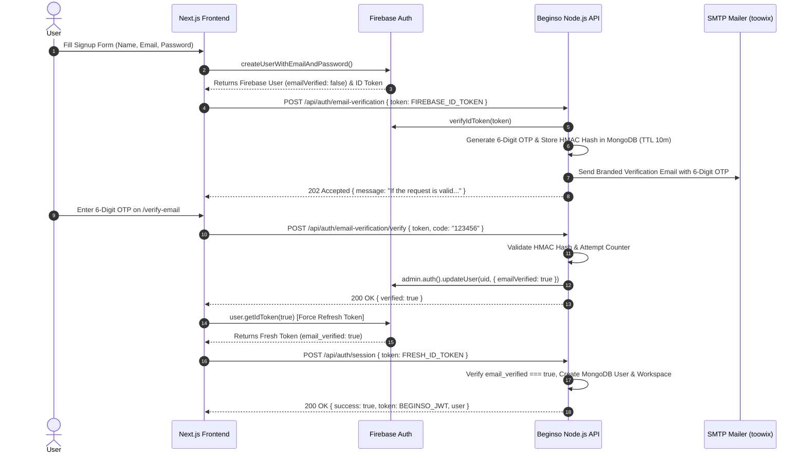
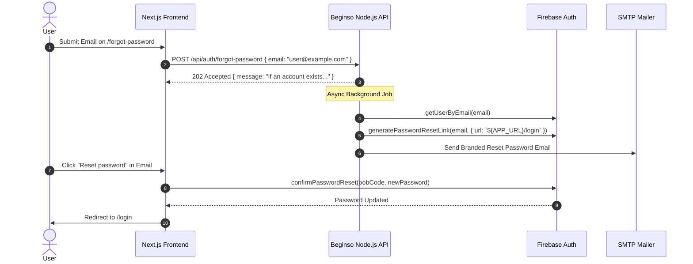

# Beginso Authentication & Email Verification Architecture Guide

**Target Audience:** Frontend Developers & Backend Developers  
**Document Version:** 1.0 (Canonical Reference)  
**Last Updated:** 07 August 2026  
**Status:** Live & Implemented in Production  

---

## Executive Summary & Contract Overview

To resolve authentication integration conflicts between Frontend and Backend, this document outlines the **complete, exact contract** for User Signup, Email Verification (both 6-Digit OTP and Firebase Signed Links), Password Reset, and Session Token Exchange.

### Key Rules
1. **Firebase is the Credential & Identity Authority**: Frontend authenticates users with Firebase Auth SDK. Passwords are stored in Firebase (hashed with Scrypt) and **never** touch MongoDB.
2. **Backend Enforces Session Gate**: The backend endpoint `POST /api/auth/session` **strictly requires** `email_verified === true` in the verified Firebase ID Token for `password` sign-in provider. Unverified password users receive a `403 Forbidden` (`code: "EMAIL_NOT_VERIFIED"`).
3. **No Direct MongoDB Creation Before Verification**: MongoDB User and Workspace records are created **only** after email verification succeeds and a valid session request is made.

---

## 1. Complete Email Verification Flows

The system supports two complementary verification flows. **Flow A (6-Digit OTP)** is the current primary flow on `/verify-email`.



---

### Flow A: 6-Digit OTP Verification (Primary Flow)

#### Step 1: User Signup on Frontend
* Client calls Firebase `createUserWithEmailAndPassword(auth, email, password)`.
* Client receives Firebase User with `emailVerified = false` and gets ID Token via `user.getIdToken()`.

#### Step 2: Request 6-Digit OTP Code
* **Endpoint**: `POST /api/auth/email-verification`
* **Headers**: `Content-Type: application/json`
* **Body**:
  ```json
  {
    "token": "FIREBASE_ID_TOKEN"
  }
  ```
* **Backend Processing**:
  1. Verifies Firebase ID Token via `admin.auth().verifyIdToken(token, true)`.
  2. Extracts `uid` and `email`.
  3. Generates 6-digit OTP (`crypto.randomInt(0, 1000000)`).
  4. Stores HMAC-SHA-256 hash of the code in MongoDB (`AuthOtp`) with 10-minute expiry.
  5. Sends branded HTML email containing the 6-digit OTP code to the user's email via SMTP (`email.toowix.com`).
* **Response (`202 Accepted`)**:
  ```json
  {
    "message": "If the request is valid, a verification code will be sent."
  }
  ```

#### Step 3: User Submits 6-Digit OTP Code
* **Endpoint**: `POST /api/auth/email-verification/verify`
* **Headers**: `Content-Type: application/json`
* **Body**:
  ```json
  {
    "token": "FIREBASE_ID_TOKEN",
    "code": "123456"
  }
  ```
* **Backend Processing**:
  1. Verifies Firebase ID Token.
  2. Looks up active OTP record for `uid`.
  3. Compares HMAC-SHA-256 hash in constant time (`crypto.timingSafeEqual`).
  4. On match: marks OTP as consumed and calls `admin.auth().updateUser(uid, { emailVerified: true })`.
* **Success Response (`200 OK`)**:
  ```json
  {
    "verified": true
  }
  ```
* **Error Response (`400 Bad Request`)**:
  ```json
  {
    "message": "Invalid or expired verification code."
  }
  ```

#### Step 4: Token Refresh & Session Creation
* Frontend force-refreshes Firebase user token: `await firebaseUser.getIdToken(true)`.
* Frontend sends refreshed token to `POST /api/auth/session`.
* **Endpoint**: `POST /api/auth/session`
* **Body**:
  ```json
  {
    "token": "REFRESHED_FIREBASE_ID_TOKEN"
  }
  ```
* **Response (`200 OK`)**:
  ```json
  {
    "success": true,
    "token": "BEGINSO_JWT_SESSION_TOKEN",
    "user": {
      "id": "6a74...",
      "fullName": "User Name",
      "email": "user@example.com",
      "workspaceId": "6a74..."
    }
  }
  ```

---

### Flow B: Firebase Signed Link Verification (Fallback / Direct Link)

1. **Signup**: Frontend calls `POST /api/auth/email-verification { token }`.
2. **Signed Link Generation**: Backend generates link via `admin.auth().generateEmailVerificationLink(email, { url: "${APP_URL}/verify-email" })` and emails link button to user.
3. **User Clicks Link**: Clicking link verifies email in Firebase directly and redirects to `/verify-email`.
4. **Session Creation**: Frontend calls `user.getIdToken(true)` and posts to `POST /api/auth/session`.

---

## 2. Password Reset Flow



#### Step 1: User Requests Password Reset
* **Endpoint**: `POST /api/auth/forgot-password`
* **Body**:
  ```json
  {
    "email": "user@example.com"
  }
  ```
* **Response (`202 Accepted` — Always identical to prevent email enumeration)**:
  ```json
  {
    "message": "If an account exists for that email, a password-reset link will be sent."
  }
  ```

#### Step 2: User Clicks Reset Link in Email
* Link redirects user to `${APP_URL}/login` with `oobCode`.
* Frontend passes `oobCode` and new password to Firebase SDK: `confirmPasswordReset(auth, oobCode, newPassword)`.
* Plaintext passwords **never** touch Beginso backend servers.

---

## 3. Rate Limiting & Abuse Rules

| Endpoint | Cooldown / Limit | Scope | Response on Exceeded |
|---|---|---|---|
| `POST /api/auth/email-verification` | 1 per 30s, max 5/hr | Firebase `uid` | `202 Accepted` (coalesced) |
| `POST /api/auth/email-verification/verify` | Max 5 failed attempts | Firebase `uid` | `400 Bad Request` |
| `POST /api/auth/forgot-password` | 1 per 60s, max 5/hr | HMAC(email, pepper) | `202 Accepted` (generic) |

---

## 4. Frontend Integration Summary Checklist

- [x] **Signup**: Create user in Firebase `createUserWithEmailAndPassword`.
- [x] **Send OTP Code**: Call `POST /api/auth/email-verification` with body `{ token: firebaseIdToken }`.
- [x] **Submit OTP Code**: User types 6 digits on `/verify-email`, call `POST /api/auth/email-verification/verify` with body `{ token: firebaseIdToken, code: "123456" }`.
- [x] **Refresh Token**: On OTP success (`verified: true`), execute `await firebaseUser.getIdToken(true)`.
- [x] **Create Session**: Send refreshed token to `POST /api/auth/session` to obtain Beginso JWT and workspace profile.
- [x] **Forgot Password**: Call `POST /api/auth/forgot-password` with `{ email }`.
