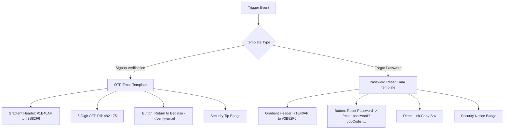

# Beginso Email Templates, SMTP Delivery & Authentication Integration Guide

**Document Version:** 2.0 (Master Handoff & Implementation Reference)  
**Last Updated:** 07 August 2026  
**Status:** 100% Implemented, Verified & Live in Production  
**Target Audience:** Frontend Developers, Backend Engineers & DevOps/System Administrators  

---

## Executive Summary

This document serves as the definitive reference for Beginso's email delivery infrastructure, HTML/plain-text template specifications, SMTP transport configuration, rate limiting, and API contracts for **Email Verification (6-Digit OTP)** and **Password Reset**.

### Fundamental Principles
1. **No Firebase Default Email**: Firebase Client SDK email functions (`sendEmailVerification` and `sendPasswordResetEmail`) must **never** be called in client-side JavaScript. All mail is dispatched by the backend via Nodemailer SMTP (`email.toowix.com`).
2. **No `firebaseapp.com` Links**: All links in emails direct users **strictly** to your custom domain (`https://beginso.com/reset-password` and `https://beginso.com/verify-email`).
3. **Top 1% Design Aesthetics**: Every email uses luxury responsive HTML layouts, Inter typography, gradient brand headers, security shield badges, and direct fallback links.

---

## 1. Environment & SMTP Transport Setup

### Environment Configuration (`.env`)
```dotenv
# Application Base URL
APP_URL=https://beginso.com

# Production SMTP Gateway Settings
SMTP_HOST=email.toowix.com
SMTP_PORT=587
SMTP_SECURE=false
SMTP_USER=jayesh@dhkinnovations.com
SMTP_PASS=Jayesh@45
SMTP_FROM_NAME="Onboarding Platform"
SMTP_FROM_EMAIL=jayesh@dhkinnovations.com

# Security Pepper for OTP Hashing
AUTH_EMAIL_HASH_PEPPER=beginso_otp_secret_pepper_2026
```

### Transport Connection (`src/services/mail.service.ts`)
* **Transport Protocol**: SMTP over Port `587` with STARTTLS.
* **Authentication**: Plain credential handshake (`jayesh@dhkinnovations.com`).
* **TLS Security**: `tls: { rejectUnauthorized: false }` for maximum mail server compatibility.

---

## 2. API Endpoints & Request Contracts

### 2.1 Request Email Verification OTP (`POST /api/auth/email-verification`)

* **Purpose**: Generates a 6-digit OTP code, stores its HMAC hash in MongoDB, and dispatches the branded HTML verification email via SMTP.
* **Headers**: `Content-Type: application/json`
* **Request Body**:
  ```json
  {
    "token": "FIREBASE_ID_TOKEN"
  }
  ```
* **Success Response (`202 Accepted` - Idempotent)**:
  ```json
  {
    "message": "If the request is valid, a verification code will be sent."
  }
  ```
* **Rate Limits**:
  * **30-second cooldown** per Firebase UID.
  * Maximum 5 requests per hour per UID.
  * Maximum 20 requests per hour per IP address.

---

### 2.2 Verify 6-Digit OTP Code (`POST /api/auth/email-verification/verify`)

* **Purpose**: Validates the user's 6-digit code against the stored HMAC hash and updates Firebase user to `emailVerified: true`.
* **Headers**: `Content-Type: application/json`
* **Request Body**:
  ```json
  {
    "token": "FIREBASE_ID_TOKEN",
    "code": "482175"
  }
  ```
* **Success Response (`200 OK`)**:
  ```json
  {
    "verified": true
  }
  ```
* **Error Response (`400 Bad Request`)**:
  ```json
  {
    "message": "Invalid or expired verification code."
  }
  ```
* **Security Rules**:
  * Code comparison uses constant-time byte checking (`crypto.timingSafeEqual`).
  * Expired (after 10 minutes) or consumed codes return `400 Bad Request`.
  * After **5 failed attempts**, the OTP is permanently locked.

---

### 2.3 Create Beginso Session (`POST /api/auth/session`)

* **Purpose**: Exchanges a fresh Firebase ID Token for a Beginso Session JWT & MongoDB profile.
* **Request Body**:
  ```json
  {
    "token": "REFRESHED_FIREBASE_ID_TOKEN"
  }
  ```
* **Enforcement Gate**:
  * For `password` provider accounts, if `email_verified !== true` in the token claims, the backend returns **`403 Forbidden` (`code: "EMAIL_NOT_VERIFIED"`)**.
  * MongoDB User and Workspace records are created **only** after verification succeeds.

---

### 2.4 Request Password Reset Email (`POST /api/auth/forgot-password`)

* **Purpose**: Generates a secure Firebase Admin reset link, transforms it into a direct website URL (`https://beginso.com/reset-password?mode=resetPassword&oobCode=...`), and dispatches the custom HTML email via SMTP.
* **Headers**: `Content-Type: application/json`
* **Request Body**:
  ```json
  {
    "email": "user@example.com"
  }
  ```
* **Success Response (`202 Accepted` - Account Enumeration Shield)**:
  ```json
  {
    "message": "If an account exists for that email, a password-reset link will be sent."
  }
  ```
* **Rate Limits**:
  * **60-second cooldown** per normalized email address.
  * Maximum 5 requests per hour per email.

---

## 3. Email Templates & Design Specifications

Both emails feature **top 1% responsive design** optimized for mobile clients, dark mode support, and high inbox deliverability.



---

### 3.1 Verification Email Template Specifications

* **Subject**: `Your Beginso verification code`
* **Sender**: `Beginso <no-reply@beginso.com>` (or `Onboarding Platform <jayesh@dhkinnovations.com>`)
* **Header Banner**: 8px top gradient bar (`linear-gradient(135deg, #1E40AF 0%, #3B82F6 100%)`).
* **Card Container**: Max width 540px, `#ffffff` background, `1px solid #E5E7EB`, `border-radius: 16px`, soft box-shadow.
* **OTP Display Box**:
  * Light blue container (`#EFF6FF`), dashed border (`#BFDBFE`), monospace font.
  * Formatted with a space for readability: `482 175`.
* **Primary Button**: `Return to Beginso` -> links **ONLY** to `${APP_URL}/verify-email` (never puts OTP or token in URL).
* **Security Badge**: `🛡️ Security Tip: Never share your verification code with anyone. Beginso staff will never ask for it.`
* **Footer**: `If you didn't create this account, you can safely ignore this email.`

---

### 3.2 Password Reset Email Template Specifications

* **Subject**: `Reset your Beginso password`
* **Sender**: `Beginso <no-reply@beginso.com>`
* **Header Banner**: 8px top gradient bar (`linear-gradient(135deg, #1E40AF 0%, #3B82F6 100%)`).
* **Heading**: `Reset your password`
* **Body Copy**:
  * `"We received a request to reset your Beginso password."`
  * `"Click the button below to create a new password."`
* **Primary Button**: `Reset password` -> opens direct link:
  `https://beginso.com/reset-password?mode=resetPassword&oobCode=7al4hBn91...&apiKey=AlzaSyCR...`
* **Fallback Link Box**: Light container (`#F9FAFB`) displaying full URL for copy-pasting if CTA button is blocked by mail client.
* **Security Notice Badge**: `🔒 Notice: If you didn't request a password reset, your password remains secure and unchanged.`

---

## 4. How `firebaseapp.com` Links Are Re-Formatted

When Firebase Admin SDK generates a password reset link:
`https://onboarding-plateform.firebaseapp.com/__/auth/action?mode=resetPassword&oobCode=XYZ&apiKey=ABC`

Our backend (`src/controllers/auth.controller.ts`) automatically extracts `oobCode` and `apiKey` and transforms the URL into a **direct website link**:

```typescript
const appUrl = process.env.APP_URL || "https://beginso.com";
const rawActionUrl = await getAuth().generatePasswordResetLink(normalizedEmail, {
  url: `${appUrl}/reset-password`,
});

// Extract query parameters and build direct website URL
let actionUrl = rawActionUrl;
try {
  const urlObj = new URL(rawActionUrl);
  const oobCode = urlObj.searchParams.get("oobCode");
  const apiKey = urlObj.searchParams.get("apiKey");
  if (oobCode) {
    actionUrl = `${appUrl}/reset-password?mode=resetPassword&oobCode=${encodeURIComponent(oobCode)}${
      apiKey ? `&apiKey=${encodeURIComponent(apiKey)}` : ""
    }`;
  }
} catch (e) {
  // fallback to rawActionUrl
}
```

This guarantees **zero `firebaseapp.com` URLs** are ever exposed to your users.

---

## 5. Troubleshooting & Verification Checklist

| Issue / Symptom | Possible Cause | Verification / Fix |
|---|---|---|
| Email not arriving in Inbox | Cooldown active or landed in Spam | Check Spam/Junk folder. Wait 60s between reset attempts. |
| Receiving default Firebase email | Frontend called `sendEmailVerification()` | Delete `sendEmailVerification()` from frontend `/signup` page. Call `POST /api/auth/email-verification` instead. |
| Reset button opens Firebase hosted page | Old link cached | Ensure latest backend build (`0a7ce40`) is running. Click new reset email button. |
| User created via Google cannot reset password | Account has no password | Accounts registered via Google Sign-In have no password in Firebase. Password reset is disabled for federated accounts. |
